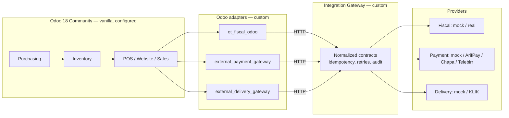

# Mati Retail Platform

A complete, runnable local retail platform for Ethiopian retailers, built on
Odoo 18 Community with a separate Integration Gateway for external systems.
The first reference customer is **Mati's Shoes** — retail, wholesale and online.

> ### ⚠️ Demo fiscal registration — not production certification
>
> Every external provider bundled here is a **mock**. The fiscal registration
> path is architecturally real but the provider is not: no IRN, QR code or
> receipt produced by this system has any legal validity in Ethiopia, and
> nothing here is certified or accredited by anyone.
>
> This is a development foundation and a demonstration, not a compliant fiscal
> system. See [What is NOT production ready](#what-is-not-production-ready).

---

## What it does

It demonstrates one complete business story, end to end, with real data moving
through real Odoo mechanics:

```
supplier → purchase order → goods receipt → main warehouse
        → internal transfer → shop 1 → contextual retail price
        → POS sale → stock decrement → fiscal transaction
        → Integration Gateway → fiscal provider → IRN + QR → stored in Odoo
```

and then the part that matters in Ethiopia:

```
fiscal provider fails → sale still completes, stock still correct
                     → visible retryable state → provider restored
                     → retry → same identity → exactly one registration
```

## Architecture in one picture



Two extension mechanisms, deliberately not collapsed into one:

- **Odoo addons** are the Odoo adapter — they know Odoo models and lifecycles.
- **The Integration Gateway** is the external-system boundary — it knows
  providers, credentials, retries and idempotency.

Full detail: [`docs/architecture.md`](docs/architecture.md).

---

## Prerequisites

| | |
|---|---|
| Docker Engine | 24+ with Compose v2 (`docker compose`, not `docker-compose`) |
| Disk | ~6 GB (Odoo image, Odoo source, Postgres volume) |
| RAM | 4 GB available to Docker |
| Network | required for the first build (fetches the pinned Odoo source) |
| `make` | optional — Windows users can run `./make.ps1 <target>` instead |

## Source and version pinning

Odoo 18 Community is built **from the official Git source at a pinned commit**:

```
repository  https://github.com/odoo/odoo
branch      18.0
revision    d60ab9c928f0ea3d31ef11fc54bf3b9549b082e8
```

Set in `compose.yaml` as `ODOO_REVISION` and overridable from `.env`. The
container logs the revision it is running at every start, and it is readable at
`/opt/odoo/REVISION`.

**Odoo core is never modified.** All custom code lives in `addons/`, mounted
read-only. See [ADR-001](docs/decisions/ADR-001-do-not-modify-odoo-core.md) and
[ADR-011](docs/decisions/ADR-011-odoo-source-pinning.md).

---

## Installation and first startup

```bash
git clone <repo>
cd mati-retail-platform

cp .env.example .env     # dev defaults; change nothing to try it out

make up                  # build and start postgres, odoo, gateway
make bootstrap           # create the database, install modules, seed demo data
```

Windows without `make`:

```powershell
Copy-Item .env.example .env
./make.ps1 up
./make.ps1 bootstrap
```

The first build takes several minutes: it fetches the pinned Odoo source and
Odoo compiles its web assets on first start. Subsequent starts take seconds.

### Service URLs

| Service | URL | Notes |
|---|---|---|
| Odoo | <http://localhost:8069> | the ERP |
| Integration Gateway | <http://localhost:8000> | |
| Gateway API docs | <http://localhost:8000/docs> | live OpenAPI |
| Gateway health | <http://localhost:8000/health> | public |
| PostgreSQL | `localhost:5432` | bound to `127.0.0.1` only |

### Demo credentials

| | |
|---|---|
| Odoo login | `admin` |
| Odoo password | `admin` |
| Database | `odoo` |
| Odoo master password | `admin_master_dev` |
| Gateway API key | `dev-gateway-api-key-change-me` |

**Development values.** They live in `.env.example` and are safe to commit
precisely because they are worthless. Never put a real credential in that file.

### Verify it actually works

```bash
make verify
```

This runs [`tools/verify_demo.py`](tools/verify_demo.py) **inside Odoo**: it
creates a real purchase order, receives it, transfers stock, sells through the
POS, fiscalizes through the gateway to the mock provider, forces a provider
failure, recovers from it, and asserts the exact quantities and prices at every
step. It exits non-zero if anything is wrong.

---

## Seeded data

Deterministic, so the demo script and the verification can assert exact numbers.
Seeding is idempotent — running it twice changes nothing.

**Company:** Mati's Shoes PLC · TIN `0012345678` · ETB · Addis Ababa
**Supplier:** ABC Footwear Factory

**Products** — two templates, Color × Size, eight variants:

| SKU | Barcode (valid EAN-13) | Variant |
|---|---|---|
| `SAM-BLK-41` | `2000004100001` | Adidas Samba / Black / 41 |
| `SAM-BLK-42` | `2000004200008` | Adidas Samba / Black / 42 |
| `SAM-WHT-41` | `2000014100008` | Adidas Samba / White / 41 |
| `SAM-WHT-42` | `2000014200005` | Adidas Samba / White / 42 |
| `AIR-*` | `20001041…` | Nike Air Max, same four combinations |

The SKU and the barcode are different identifiers for the same variant. Barcodes
carry correct EAN-13 check digits, so they scan.

**Opening stock:**

| SKU | Main WH | Shop 1 | Shop 2 |
|---|---:|---:|---:|
| `SAM-BLK-41` | 20 | 5 | 8 |
| `SAM-BLK-42` | **10** | 3 | 6 |
| `SAM-WHT-41` | 18 | 7 | 4 |
| `SAM-WHT-42` | 12 | 2 | 9 |

`SAM-BLK-42` opens at 10 on purpose: the purchase demo receives 20 more and the
expected result is exactly 30.

**Pricing** — one product identity, four prices:

| Context | `SAM-BLK-42` |
|---|---:|
| Retail | 6,000 ETB |
| Online | 6,200 ETB |
| Wholesale | 5,300 ETB |
| Wholesale, 20+ units | 5,000 ETB |

**Vendor prices:** `SAM-BLK-42` = 3,200 ETB · `SAM-WHT-42` = 3,100 ETB

**Locations:** Mati Main Warehouse (`MAIN`), Shop 1 Retail (`SHOP1`),
Shop 2 Wholesale (`SHOP2`)

**Point of sale:** *Shop 1 Retail POS* (retail pricelist, Shop 1 stock) and
*Shop 2 Wholesale POS* (wholesale pricelist, Shop 2 stock)

---

## Demo walkthrough

[`docs/demo-script.md`](docs/demo-script.md) is written to be read out loud
while sitting with the client. Thirteen steps, business language, ending with
the failure-and-recovery scenario as a technical confidence demonstration.

Quick version:

```bash
make verify          # prove the whole path works
make fiscal-fail     # break the fiscal provider on purpose
# ... sell something: the sale completes, fiscal goes to Failed
make fiscal-ok       # restore it, then click Retry: one IRN, not two
```

---

## Developer commands

```
make up            start everything          make test          run every test suite
make down          stop (keeps data)         make test-gateway  gateway tests only
make bootstrap     create + populate DB      make test-odoo     Odoo addon tests only
make seed          re-seed (idempotent)      make verify        end-to-end verification
make reset         back to opening state     make health        check all services
make logs          tail all logs             make fiscal-fail   break the fiscal provider
make ps            service status            make fiscal-ok     restore it
make shell-odoo    Odoo shell                make psql-odoo     psql on the Odoo DB
make nuke          remove containers + DATA   make psql-gateway  psql on the gateway DB
```

Every target also exists as `./make.ps1 <target>` on Windows.

## Database inspection

```bash
make psql-odoo      # business data
make psql-gateway   # integration data
```

Useful queries:

```sql
-- Odoo: stock by location for one variant
SELECT l.complete_name, q.quantity
FROM stock_quant q
JOIN product_product p ON p.id = q.product_id
JOIN stock_location l ON l.id = q.location_id
WHERE p.default_code = 'SAM-BLK-42' AND l.usage = 'internal';

-- Odoo: fiscal transactions
SELECT name, state, irn, attempt_count, last_error
FROM et_fiscal_transaction ORDER BY create_date DESC LIMIT 10;

-- Gateway: one registration per idempotency key, always
SELECT idempotency_key, count(*), count(DISTINCT irn)
FROM fiscal_documents GROUP BY idempotency_key HAVING count(*) > 1;

-- Gateway: full attempt history for a document
SELECT attempt, outcome, error, duration_ms, created_at
FROM integration_requests WHERE resource_id = '<id>' ORDER BY created_at;
```

The full audit trail for one fiscal document in one call:

```bash
curl -H "X-API-Key: dev-gateway-api-key-change-me" \
  http://localhost:8000/api/v1/admin/audit/fiscal_document/<gateway_document_id>
```

---

## Development

### Odoo addon development

`addons/` is mounted into the container, so edits are visible immediately. Odoo
still needs a module upgrade to pick up model, view or data changes:

```bash
docker compose run --rm odoo odoo -d odoo -u et_fiscal_odoo --stop-after-init
docker compose restart odoo
```

| Addon | What it is |
|---|---|
| `et_fiscal_odoo` | reusable Ethiopian fiscal connector — **not** Mati-specific |
| `external_payment_gateway` | Odoo payment provider routed through the gateway |
| `external_delivery_gateway` | Odoo delivery carrier routed through the gateway |
| `mati_demo` | Mati-specific configuration and seed data — **no** generic logic |

Each has its own `README.md`.

### Gateway development

```bash
docker compose logs -f gateway          # structured JSON logs
docker compose restart gateway          # app/ is mounted; restart to reload
```

Run the gateway suite locally without Docker:

```bash
python -m venv .venv && .venv/bin/pip install -e "gateway[dev]"
cd gateway && python -m pytest -q      # uses SQLite; no Postgres needed
```

Schema changes go through Alembic:

```bash
docker compose exec gateway alembic revision --autogenerate -m "describe it"
docker compose exec gateway alembic upgrade head
```

### Adding a real provider

One class plus one registry line. No Odoo change, no migration, no contract
change. Step by step:
[`docs/integration-contracts.md#adding-a-real-provider`](docs/integration-contracts.md#adding-a-real-provider).

```bash
FISCAL_PROVIDER=myprovider     # then restart the gateway. That is the whole switch.
```

## Testing

```bash
make test            # everything
make test-gateway    # 110 tests: contracts, idempotency, failure, retry, security
make test-odoo       # Odoo addon tests
make verify          # end-to-end against a live stack
```

| Suite | Where | Needs |
|---|---|---|
| Gateway | `gateway/tests/` | nothing — SQLite, no Odoo |
| Contract | `tests/contract/` | nothing — replays the real Odoo payloads |
| Odoo addons | `addons/*/tests/` | Odoo |
| End to end | `tools/verify_demo.py` | the full running stack |

## Resetting

```bash
make reset    # back to the seeded opening state; keeps fiscal history
make nuke     # remove containers AND all data. Destructive.
```

`make reset` deliberately keeps fiscal transactions. Deleting a registration
history is exactly what a fiscal system must never do.

## Troubleshooting

| Symptom | Cause and fix |
|---|---|
| `make up` fails on the Odoo build | No network, or GitHub unreachable. The build fetches the pinned Odoo source. |
| Odoo is slow on first page load | It is compiling web assets. Once. |
| `bootstrap` says the database exists | It is updating modules instead. `make nuke` first for a genuinely clean rebuild. |
| Gateway health is `fail` | The database is not ready or migrations did not run: `docker compose logs gateway`. |
| Fiscal transactions stay `failed` | Check `make health`, then Settings → Ethiopian Fiscalization → **Test Gateway Connection**. Also check whether failure mode is on: `make fiscal-ok`. |
| POS will not open a session | Needs a chart of accounts and a cash journal. The seed loads `generic_coa`; check the bootstrap log. |
| `make verify` fails at the POS step | Usually a missing POS payment method. `make seed` re-creates it. |
| Port already in use | Change `ODOO_PORT` / `GATEWAY_PORT` in `.env`. |
| Shell scripts fail on Windows | Use `./make.ps1`, and ensure Git checked files out with LF (`.gitattributes` enforces it). |

---

## What is vanilla Odoo

Roughly 80% of this platform. Products, variants, attributes, SKUs, barcodes,
purchase orders, receipts, stock, warehouses, locations, transfers, pricelists,
quantity pricing, POS, sales orders, invoicing, customers, suppliers, website.

We **configured** those. We did not write them.

Full evidence table:
[`docs/vanilla-vs-custom.md`](docs/vanilla-vs-custom.md).

## What is custom

Exactly the things that cross the company boundary, because Odoo cannot know
about Ethiopian external systems:

- **`et_fiscal_odoo`** — fiscal transaction model, state machine, contract
  mapping, retry, IRN/QR display.
- **`external_payment_gateway`** — an Odoo payment provider routed through the
  gateway, built on Odoo's native payment framework.
- **`external_delivery_gateway`** — an Odoo delivery carrier routed through the
  gateway, built on Odoo's native delivery framework.
- **The Integration Gateway** — provider adapters, credentials, retries,
  idempotency, webhook verification, the integration audit trail.
- **`mati_demo`** — Mati's configuration and seed data. No business logic.

## What is mocked

| Rail | Bundled | Real options |
|---|---|---|
| Fiscal | `MockFiscalProvider` — own ledger, deterministic IRN, injectable failure | `mor`, `accredited` — **extension points, not implemented** |
| Payment | `MockPaymentProvider` — success / manual / always-fail | `arifpay`, `chapa`, `telebirr` — **extension points, not implemented** |
| Delivery | `MockDeliveryProvider` — seven-state lifecycle | `klik` — **extension point, not implemented** |

The extension points raise a structured `ProviderNotConfigured` listing the
settings they need and the blockers outstanding. They do **not** fabricate API
behaviour: we do not have authoritative specifications for these systems, and a
plausible-looking fake would pass review and fail in production.

## What is NOT production ready

Be clear with anyone who sees this demo:

1. **Fiscalization is not compliant.** The provider is a mock. No IRN, QR code
   or receipt has legal validity. Real deployment needs an authoritative MoR
   technical specification or an accredited provider, accreditation,
   production credentials, a digital certificate and a precise offline
   resiliency specification.
2. **No real payment rail.** No funds move.
3. **No real courier.** Nothing is dispatched.
4. **Security is development grade.** Shared API key, one HMAC secret for all
   webhooks, secrets in a `.env` file, plain HTTP inside the Docker network,
   one database superuser. See
   [Production hardening](docs/architecture.md#production-hardening).
5. **Single Odoo process.** `workers = 0`, no reverse proxy, no TLS.
6. **No backups, no monitoring, no alerting.**
7. **The offline path demonstrates the architecture**, not Ethiopia's production
   store-and-forward protocol.

Full, honest accounting — including what could not be executed in the build
environment: [`IMPLEMENTATION_REPORT.md`](IMPLEMENTATION_REPORT.md).

---

## Repository layout

```
compose.yaml            postgres + odoo + gateway
.env.example            all configuration; no real secrets, ever
Makefile / make.ps1     developer commands (POSIX / Windows)

odoo/                   Dockerfile building Odoo from the pinned revision
config/odoo.conf        Odoo configuration (addons_path, single worker, dbfilter)

addons/
  et_fiscal_odoo/           reusable Ethiopian fiscal connector
  external_payment_gateway/ payment rail adapter
  external_delivery_gateway/delivery rail adapter
  mati_demo/                Mati configuration and seed data

gateway/
  app/domain/           normalized contracts, services, state machines
  app/providers/        one package per rail, one module per provider
  app/persistence/      the gateway's own database
  app/api/              HTTP surface
  migrations/           Alembic
  tests/                110 tests, no Odoo required

scripts/                bootstrap, seed, reset, verify, health
tools/verify_demo.py    end-to-end verification, runs inside Odoo
tests/contract/         Odoo payload ↔ gateway contract
docs/                   architecture, demo script, contracts, ADRs
```

## Documentation

| Document | For |
|---|---|
| [`docs/architecture.md`](docs/architecture.md) | how it fits together, with diagrams |
| [`docs/demo-script.md`](docs/demo-script.md) | the business walkthrough |
| [`docs/vanilla-vs-custom.md`](docs/vanilla-vs-custom.md) | what is Odoo vs. what we wrote |
| [`docs/fiscal-integration.md`](docs/fiscal-integration.md) | the fiscal rail in detail |
| [`docs/integration-contracts.md`](docs/integration-contracts.md) | wire contracts; adding a provider |
| [`docs/decisions/`](docs/decisions/) | 11 architecture decision records |
| [`IMPLEMENTATION_REPORT.md`](IMPLEMENTATION_REPORT.md) | what works, what is mocked, what remains |

## License

Odoo 18 Community is LGPL-3. The addons here are LGPL-3 to match.
