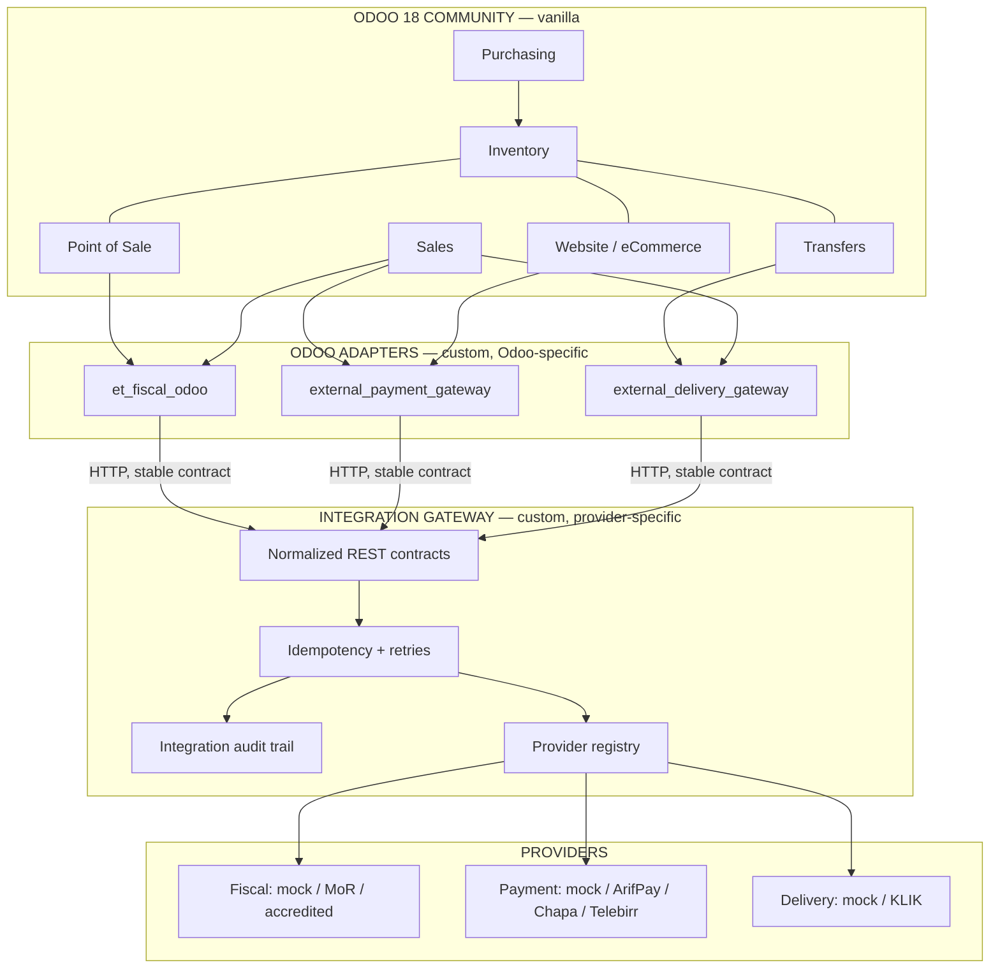
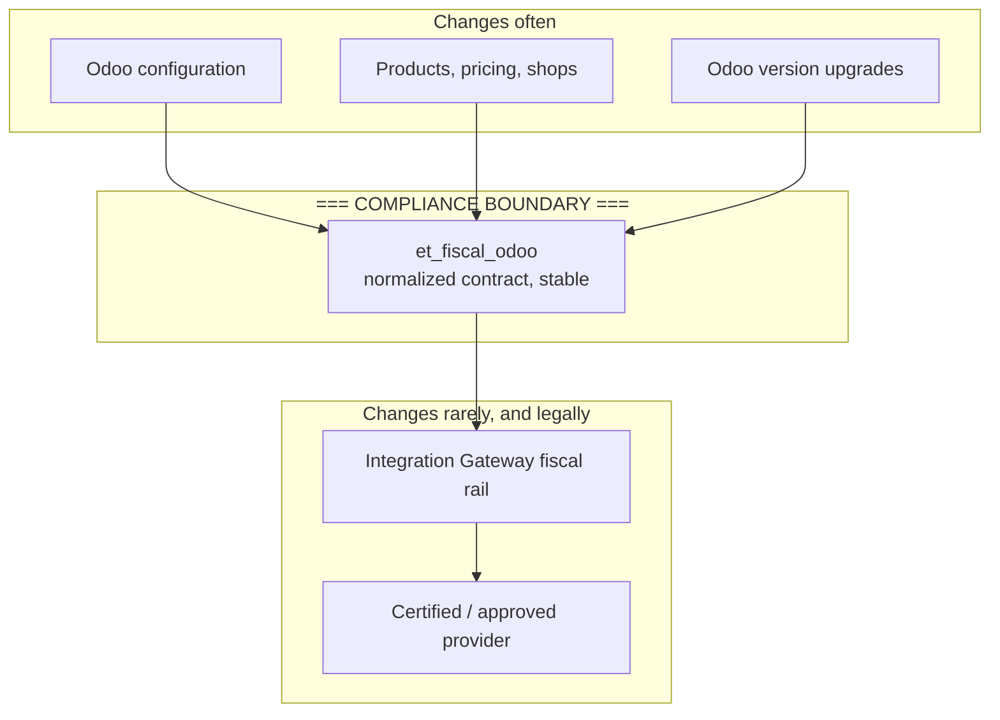
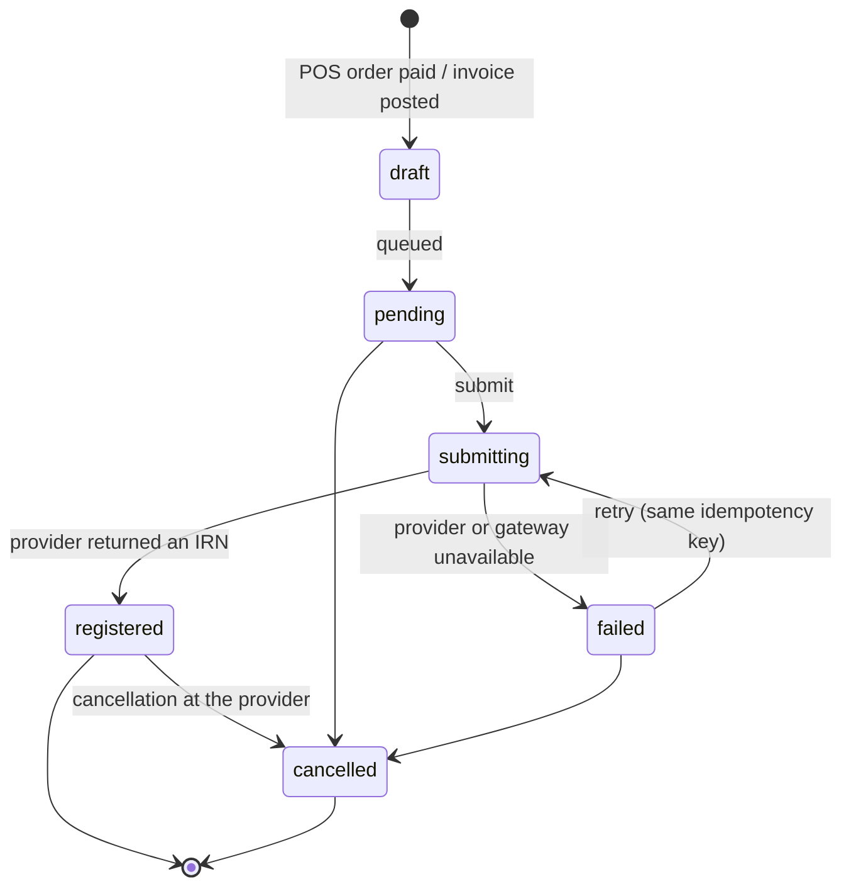
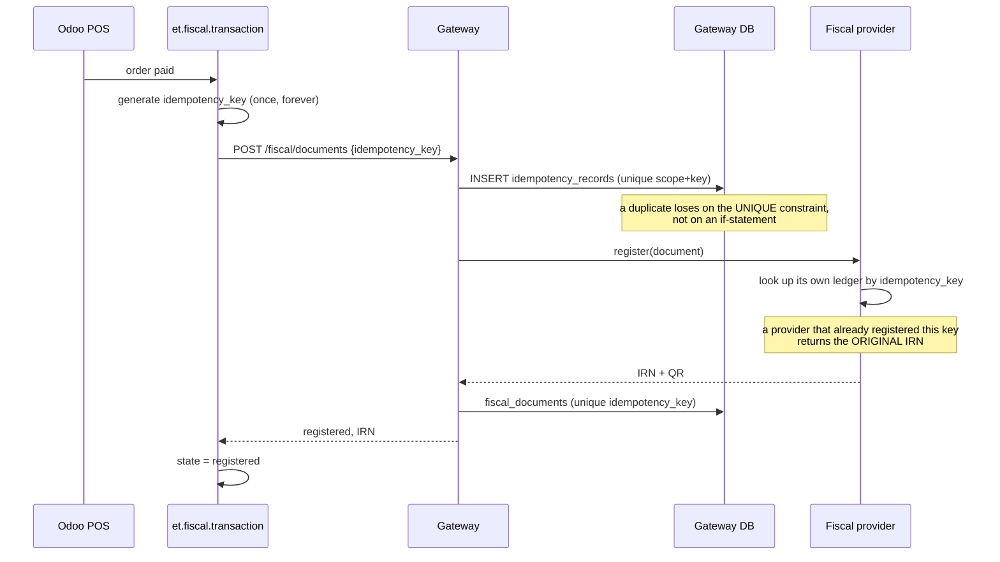
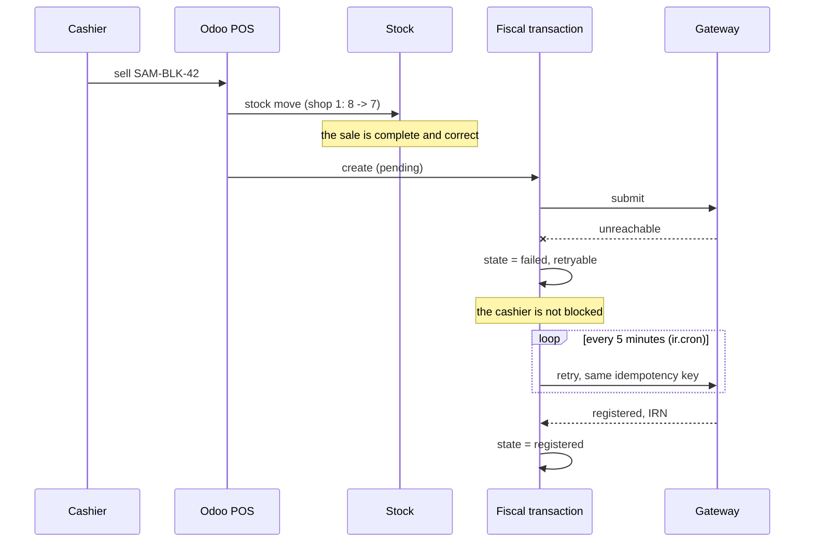
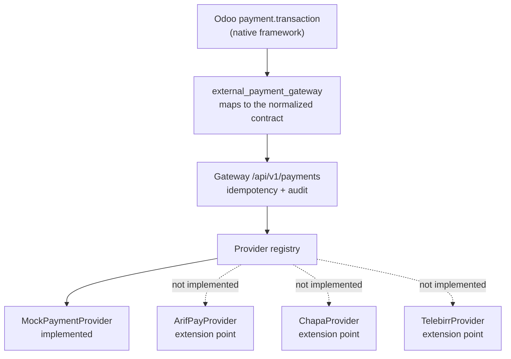
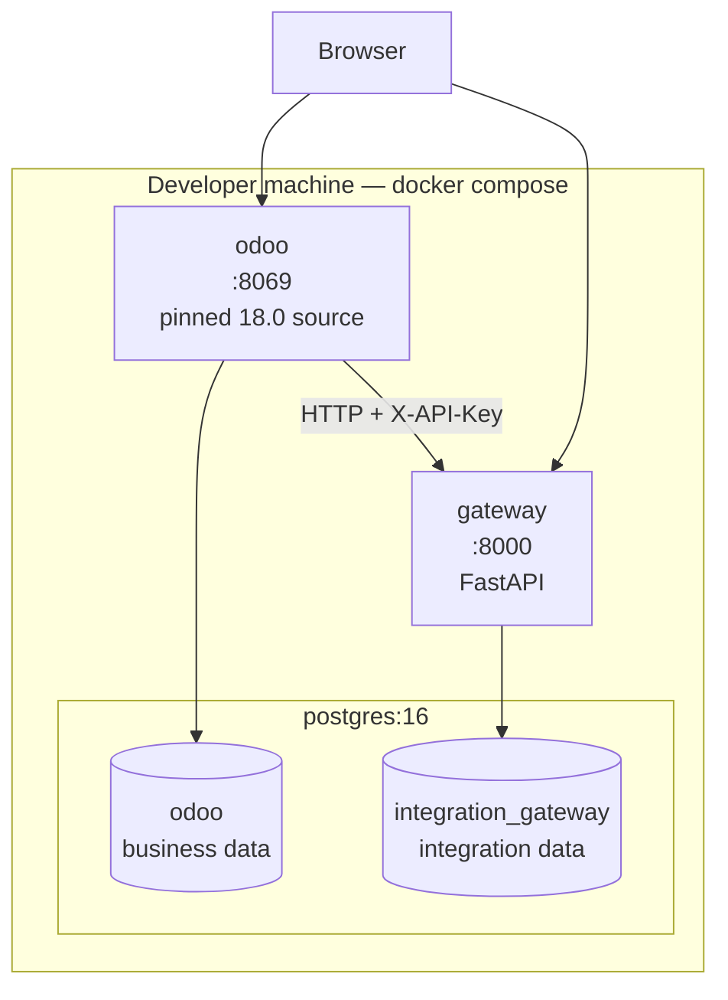
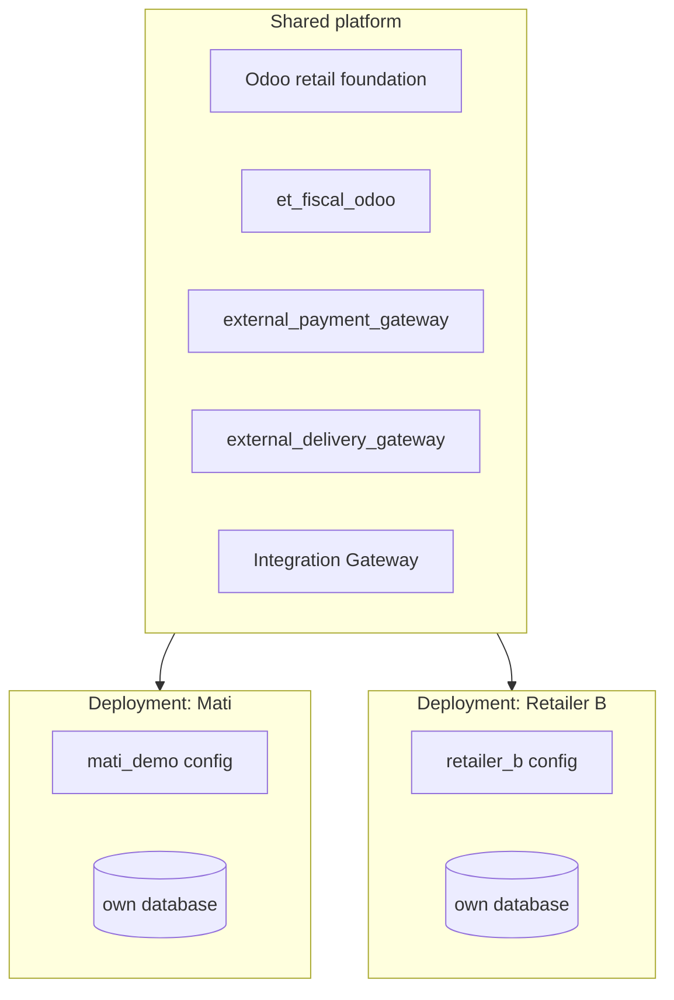

# Architecture

> **Demo fiscal registration — not production certification.** Every provider
> bundled with this platform is a mock. Nothing it produces is a legally valid
> Ethiopian fiscal registration.

## The one-sentence version

Odoo 18 Community does the retail business — products, stock, purchasing,
pricing, POS, sales — and a separate Integration Gateway does everything that
crosses the company boundary: fiscal registration, payment rails, delivery
couriers.

## Why two extension mechanisms

It is tempting to put everything in Odoo addons. That produces a system where
swapping a payment provider means an Odoo migration, where provider
credentials live in the ERP database, and where a fiscal API change forces a
redeploy of the whole ERP.

The split we use instead:

| | Odoo addons | Integration Gateway |
|---|---|---|
| Knows about | Odoo models, Odoo lifecycles, Odoo UI | providers, HTTP, credentials, retries |
| Owns | when a fiscal document is needed, and what it contains | how it reaches a provider and what came back |
| Changes when | Odoo changes, or the business changes | a provider changes |
| Contains secrets | no | yes |
| Can be reused by another ERP | no | yes |

They are not redundant layers. The addon is **the Odoo adapter**; the gateway
is **the external-system boundary**.

## The business workflow

```mermaid
flowchart LR
    S[Supplier<br/>ABC Footwear] --> PO[Purchase Order]
    PO -->|confirm: no stock yet| RCP[Incoming Shipment]
    RCP -->|validate: stock moves| MAIN[(Main Warehouse)]
    MAIN --> TR[Internal Transfer]
    TR --> SHOP1[(Shop 1 Retail)]
    SHOP1 --> SALE[POS Sale<br/>retail pricelist]
    SALE --> PAYMENT[Payment]
    PAYMENT --> DEC[Stock decrement]
    DEC --> FT[et.fiscal.transaction]
    FT --> GWY[Integration Gateway]
    GWY --> MOCK[Mock fiscal provider]
    MOCK --> RES[IRN + QR]
    RES --> ODOO[Stored and displayed in Odoo]
    SHOP1 -.-> DELIV[Delivery where applicable]
```

Every arrow before `et.fiscal.transaction` is **vanilla Odoo**. Everything from
there on is the custom integration boundary.

## Fiscalization is a compliance boundary

Odoo configuration changes often: new products, new shops, new pricelists, an
Odoo upgrade. Fiscal rules change on a completely different clock, and when
they do, the change is legally significant.

The contract in `app/domain/contracts.py` is the seam. As long as Odoo can
produce that document, the fiscal side can be replaced without touching Odoo,
and Odoo can be upgraded without touching the fiscal side.

## Fiscal state machine

Two state machines exist deliberately: one in Odoo (what the business record
knows) and one in the gateway (what the integration knows). They are not the
same machine, because Odoo must keep working when the gateway cannot be
reached.

Invalid transitions raise. `registered` can never go back to `pending`, so an
IRN cannot be lost by a careless write.

## Idempotency: why exactly one registration

Three independent layers have to agree before a duplicate becomes impossible:

1. **Odoo** — `(source_model, source_record_id, document_type)` is unique, so
   one POS order can only ever have one fiscal transaction. The idempotency
   key is generated once at creation and writing a different one raises.
2. **Gateway** — `idempotency_records(scope, idempotency_key)` and
   `fiscal_documents(idempotency_key)` are unique constraints.
3. **Provider** — the mock keeps its own ledger keyed by idempotency key. This
   is the layer that matters when the gateway crashes *after* the provider
   registered but *before* the response was stored. On retry, the provider
   returns the original IRN.

Layer 3 is the one people forget, and it is the one that saves you.

## Offline and failure semantics

A shop with an intermittent connection must keep selling.

A provider failure is **not** an HTTP error from the gateway. The gateway
accepted and durably recorded the request, so it answers `200` with
`status: "failed"`. Odoo reads the domain status and keeps its own record
retryable. This is what makes the offline path work; see
`docs/integration-contracts.md`.

> This demonstrates the *architecture* required for offline resilience. It is
> not an implementation of Ethiopia's production offline protocol, which we do
> not have an authoritative specification for.

## Payment provider architecture

Switching rails is `PAYMENT_PROVIDER=arifpay` plus a restart. No Odoo change,
no database migration, no redeploy of the ERP.

## Deployment topology

Note what is **not** drawn: there is no arrow from the gateway to the Odoo
database, and none from Odoo to the gateway database. That is enforced by
configuration — the gateway is only given `GATEWAY_DATABASE_URL` — and it is
the property that lets the gateway serve a different ERP later (ADR-006).

## Productization

Each customer gets their own deployment and their own database. Shared-database
multitenancy is deliberately *not* built (ADR-010): it is the hardest thing to
retrofit out of, and nothing about a three-shop shoe retailer requires it.

## Production hardening

This is a **development** environment. Before anything resembling production:

| Area | Here | Production needs |
|---|---|---|
| Gateway auth | shared `X-API-Key` | mTLS or OAuth2 client credentials, per-client keys, rotation |
| Webhook auth | HMAC over the body with one shared secret | per-provider schemes, timestamp/nonce replay protection |
| Secrets | `.env` file | a secret manager; never on disk in plaintext |
| Transport | plain HTTP inside a Docker network | TLS everywhere, including internal hops |
| Database | one superuser role for both databases | separate least-privilege roles per database |
| Postgres port | bound to `127.0.0.1` | not exposed at all |
| Odoo workers | `workers = 0` (single process) | multi-worker behind a reverse proxy, `proxy_mode = True` |
| `list_db` | `True` | `False`, with a strong master password |
| Fiscal provider | mock | accredited provider, real credentials, digital certificate |
| Rate limiting | none | per-client limits on the gateway |
| Backups | none | PITR on both databases; the fiscal audit trail is a legal record |
| Monitoring | structured logs to stdout | log aggregation, alerting on `fiscal.failed` and retry-backlog depth |

## Further reading

- `docs/vanilla-vs-custom.md` — what is Odoo, what we wrote, and why
- `docs/fiscal-integration.md` — the fiscal rail in detail
- `docs/integration-contracts.md` — the wire contracts and how to add a provider
- `docs/demo-script.md` — the business walkthrough
- `docs/decisions/` — the architecture decision records
