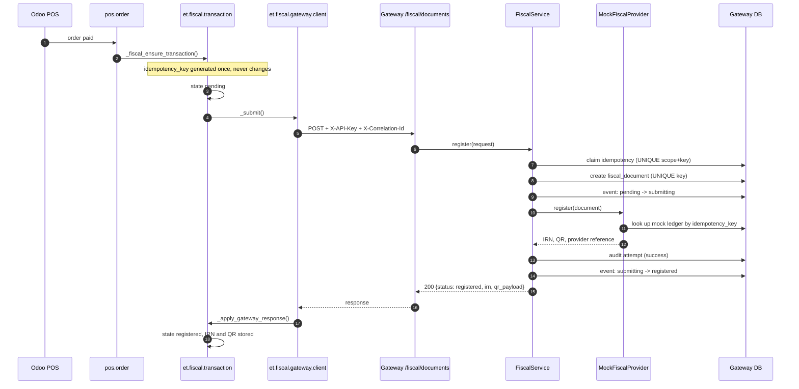

# Fiscal integration

> **Demo fiscal registration — not production certification.** The bundled
> fiscal provider is a mock. Its IRN format, QR payload and endpoint shape are
> **invented for this demo**. Do not read anything official into them.

## What we do and do not know

We deliberately did **not** implement an Ethiopian government API, because we
do not have an authoritative specification for one. Inventing endpoints would
produce code that looks finished, passes review, and fails in production — the
worst possible outcome.

What we built instead is the part that is knowable and that a real integration
will need regardless of the provider's specifics:

- an explicit fiscal document lifecycle in Odoo;
- a normalized, provider-neutral document contract;
- idempotency strong enough that a lost response cannot double-register;
- retry and offline recovery;
- an audit trail that survives failures;
- a provider interface a real implementation drops into.

See `docs/integration-contracts.md#adding-a-real-fiscal-provider` for exactly
what a real implementation has to fill in, and
`gateway/app/providers/fiscal/placeholders.py` for the enumerated blockers.

## The path a sale takes



## The fiscal transaction model

`et.fiscal.transaction` (Odoo side) mirrors `fiscal_documents` (gateway side).
They are independent records linked only by the idempotency key — neither
system writes into the other's database.

| Field | Purpose |
|---|---|
| `name` | human reference, `FT/2026/000001` |
| `source_model`, `source_record_id` | answers *which Odoo transaction triggered this* |
| `source_reference` | the readable document name |
| `document_type` | receipt / invoice / credit_note / refund_receipt |
| `idempotency_key` | **immutable** logical identity of the document |
| `state` | explicit state machine (below) |
| `currency_id`, `amount_untaxed`, `amount_tax`, `amount_total` | the amounts registered |
| `provider`, `provider_transaction_id` | which provider handled it, and its reference |
| `gateway_document_id` | the gateway resource id |
| `irn`, `qr_payload` | the fiscal result |
| `attempt_count`, `last_error` | how hard we tried, and why it failed |
| `correlation_id` | ties Odoo, gateway logs and audit rows together |
| `request_payload`, `last_response` | exactly what we sent and received |
| `submitted_at`, `registered_at`, `cancelled_at` | the timeline |

Two database constraints do the heavy lifting:

```sql
UNIQUE (idempotency_key)
UNIQUE (source_model, source_record_id, document_type)
```

The second is duplicate-trigger protection: a POS order cannot acquire two
fiscal transactions no matter how many times the hook fires.

## State machine

```
draft ──► pending ──► submitting ──► registered ──► cancelled
                          │
                          └────────► failed ──► submitting (retry)
```

Enforced by `_set_state()`, which refuses any transition not declared in
`ALLOWED_TRANSITIONS`. The two that matter:

- `registered → pending` is **impossible**, so an IRN cannot be lost by a
  careless write;
- `failed → submitting` is **allowed**, so recovery is a normal operation
  rather than a manual database fix.

## Idempotency: three layers

A single unique constraint is not enough. The failure that actually bites is
"the provider registered it, then we lost the response". Three layers:

| Layer | Mechanism | Protects against |
|---|---|---|
| Odoo | `UNIQUE (source_model, source_record_id, document_type)` | the trigger firing twice |
| Gateway | `UNIQUE (scope, idempotency_key)` and `UNIQUE (fiscal_documents.idempotency_key)` | the ERP sending twice, concurrently |
| Provider | the mock's own ledger keyed by idempotency key | a lost response after a successful registration |

The third layer is the one people forget. `gateway/tests/test_fiscal.py::
test_lost_response_cannot_create_a_second_irn` deletes the gateway's entire
memory of a registration — document row and idempotency record — and re-posts.
The provider recognises the key and returns the **original** IRN.

A real provider must offer the same guarantee. If a candidate provider cannot,
that is a serious finding worth raising during integration, because no amount
of gateway code can fully compensate for it.

## Failure, retry and offline

### What failure means at each layer

| Layer | Failure looks like | Result |
|---|---|---|
| Provider transient (timeout, 5xx) | `ProviderTransientError` | retried inside the gateway, up to `GATEWAY_MAX_ATTEMPTS`, exponential backoff |
| Provider permanent (rejected document) | `ProviderPermanentError` | **not** retried; recorded and returned immediately |
| Gateway unreachable from Odoo | `GatewayError` in the Odoo client | fiscal transaction → `failed`, retryable; the cron picks it up |
| Gateway reached, provider down | HTTP 200 with `status: "failed"` | same: `failed`, retryable |

Note the deliberate choice: **a provider failure is not an HTTP error.** The
gateway accepted and durably recorded the request, so it answers `200` with a
domain status. The ERP reads `status`, not the HTTP code. This is what makes
the offline path simple — see `docs/integration-contracts.md`.

### Offline recovery

`ir.cron` — *Fiscal: submit pending and failed documents* — runs every five
minutes and drains everything still in `pending` or `failed`, up to
`et_fiscal.max_auto_retries` attempts each. Each document carries its original
idempotency key, so draining a backlog of 200 sales after a day-long outage
produces exactly 200 registrations.

The cron commits per document, so one poisoned document cannot block the rest
of the backlog.

> This demonstrates the *architecture* required for offline resilience. It is
> not an implementation of Ethiopia's production store-and-forward protocol,
> whose exact rules (buffering limits, permitted offline window, sequence
> requirements) we do not have.

### Demonstrating it

```bash
make fiscal-fail     # force the mock provider to fail
# ... make a sale in the POS: it completes, stock moves, fiscal goes to Failed
make fiscal-ok       # restore the provider
# ... click Retry on the fiscal transaction: Registered, one IRN
```

Or in Odoo: **Mati Demo → Demo Controls → Toggle Mock Fiscal Failure Mode**.

## Receipt output

Fiscal status, IRN and QR code appear in three places:

1. **The fiscal transaction form** — status, IRN, provider reference, QR image
   rendered by Odoo's own barcode controller, plus the exact request and
   response for debugging.
2. **The fiscal receipt report** (`pos.order` → *Print Fiscal Receipt*) — a
   reprintable receipt carrying the fiscal block.
3. **The customer invoice PDF** — the fiscal block is appended to the standard
   Odoo invoice report.

All three are labelled:

```
DEMO FISCAL REGISTRATION - NOT PRODUCTION CERTIFICATION
```

### Why not the POS front-end receipt?

Two reasons, both practical:

1. **Timing.** Fiscal registration completes *after* the sale. The receipt
   printed at the moment of payment cannot contain an IRN that does not exist
   yet. A shop needs a *reprintable* fiscal receipt, which is what we built.
2. **Blast radius.** A bad xpath into the POS front-end templates breaks the
   point of sale. A bad QWeb report breaks a report.

Patching the POS OWL receipt to show a *pending* fiscal marker at sale time is
a reasonable enhancement, and it is on the next-slice list in
`IMPLEMENTATION_REPORT.md`. It was not worth risking the till for the first
demo.

## The QR payload

The mock builds a compact, pipe-delimited payload and base64-encodes it:

```
ETDEMO1|<IRN>|<seller TIN>|<buyer TIN>|<doc number>|<YYYYMMDDHHMMSS>|<total>|<tax>|<currency>
```

Real fiscal QR codes carry a **signed**, provider-defined payload. The signing
seam lives in the gateway (`MockFiscalProvider._build_qr_payload`, which a real
adapter replaces with its own `_sign()`), so adding a digital certificate later
touches the gateway only — never Odoo.

## Auditability

For any fiscal document, these questions are answerable:

| Question | Where |
|---|---|
| Which Odoo transaction triggered this? | `source_model` + `source_record_id`, and the **Source Document** button |
| What did we request? | `request_payload` in Odoo; `integration_requests.request_payload` in the gateway (redacted) |
| When? | `submitted_at`, plus `created_at` on every audit row |
| Which provider? | `provider`, on both sides |
| What happened? | `integration_events` — every status transition, append-only |
| How many attempts? | `attempt_count`, and one `integration_requests` row per attempt |
| What response was received? | `last_response` in Odoo; `response_payload` per attempt in the gateway |
| What IRN resulted? | `irn` on both sides |
| Was it retried? | the sequence of `integration_requests.outcome` values |

One call returns all of it:

```bash
curl -H "X-API-Key: $GATEWAY_API_KEY" \
  http://localhost:8000/api/v1/admin/audit/fiscal_document/<gateway_document_id>
```

Failure history is **never** overwritten by a later success. A document that
failed three times and then registered shows four attempt rows:
`transient_error, transient_error, transient_error, success`.

## Cancellation

A registered document can be cancelled at the provider (`action_cancel` on the
fiscal transaction). The mock marks its ledger entry cancelled and refuses to
re-register that key — which is the correct behaviour: a cancelled fiscal
document must not quietly come back to life.

## Security notes for the fiscal rail

- Odoo holds only the gateway URL and the gateway API key. It never holds a
  fiscal provider credential.
- Provider credentials, client certificates and signing keys belong to the
  gateway environment.
- Audit payloads are redacted before storage (`app/observability/redaction.py`).
- Validation errors never echo the submitted body back, so a buyer TIN cannot
  leak into an error response or a log line.
